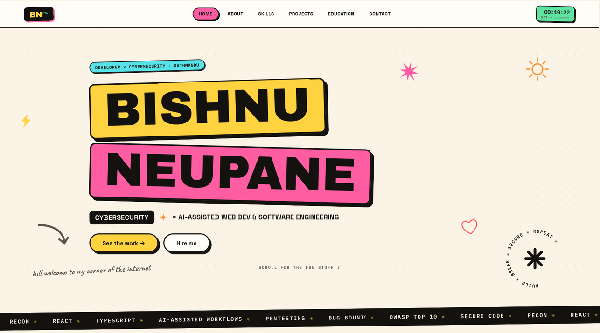

# Bishnu Neupane — Portfolio

Cybersecurity × AI-assisted web development portfolio, built completely by hand —
no component libraries, no templates. Neo-brutalist design system: sticker blocks,
hard offset shadows, hand-drawn SVG doodles, and GSAP scroll reveals.



## Pages

- **Home** — color-block hero, doodle stickers, rotating badge, scrolling tech marquee
- **About** — sticker-board collage, facts table, links
- **Skills** — 47 tools as an icon-only sticker grid across 6 lanes (hover to reveal names)
- **Projects** — alternating case-file cards with framed covers, plus an "on the bench" section
- **Education** — stamp timeline of SEE / +2 NEB / BE, coursework chips, ticket-style certs
- **Contact** — brutal form (opens mail client) and social links

## Stack

| Layer   | Tech                                              |
| ------- | ------------------------------------------------- |
| Framework | [React 19](https://react.dev) + [TypeScript](https://typescriptlang.org) on [Vite](https://vite.dev) |
| Routing | react-router-dom (HashRouter)                     |
| Motion  | GSAP + ScrollTrigger, Lenis smooth scroll         |
| Styling | Hand-rolled CSS design system (`src/index.css` + `src/App.css`) |
| Icons   | Hand-drawn SVG doodles + brand marks (`src/components/Icons.tsx`) |

## Run locally

```bash
npm install
npm run dev      # http://localhost:5173
npm run build    # production build in dist/
npm run lint     # oxlint
```

## Details

- Respects `prefers-reduced-motion` (marquees, reveals, badge rings)
- Live Kathmandu (NPT) clock in the nav
- Fully responsive down to 390px

Created & template by [bishnuneup4ne](https://github.com/bishnuneup4ne)
